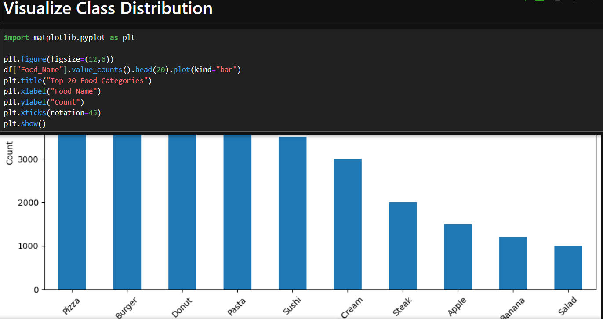
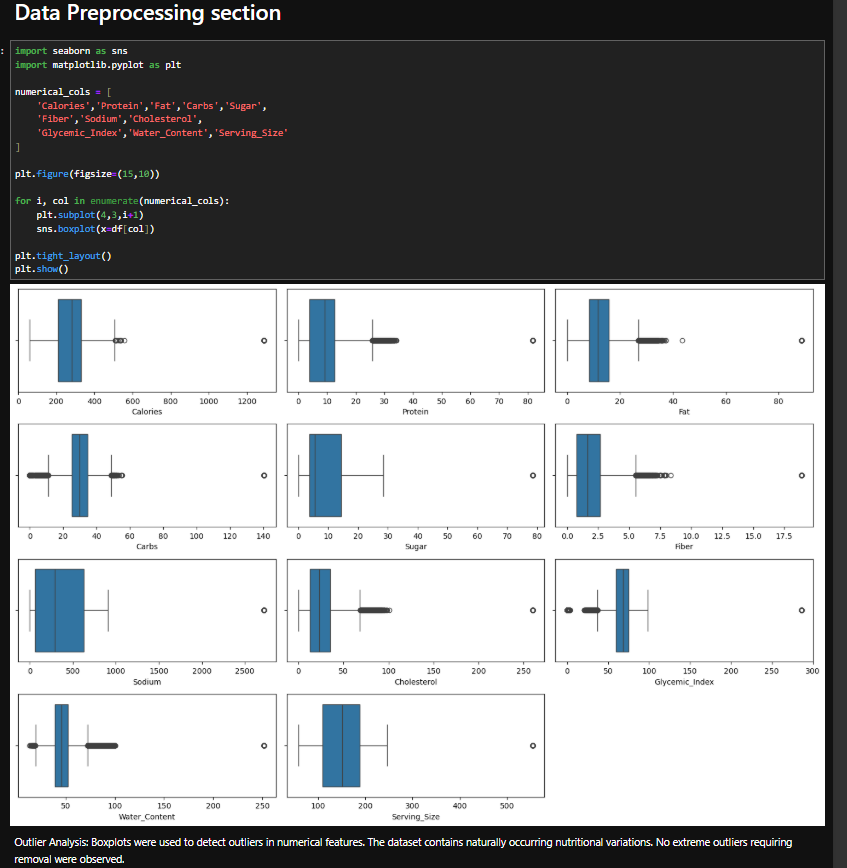
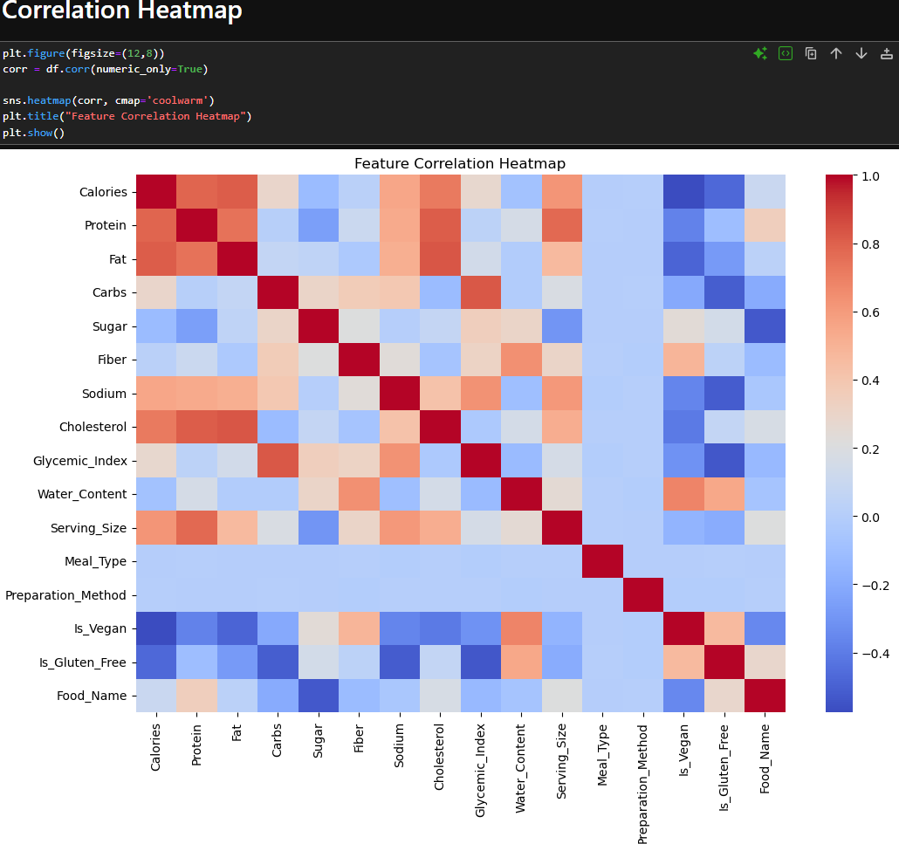
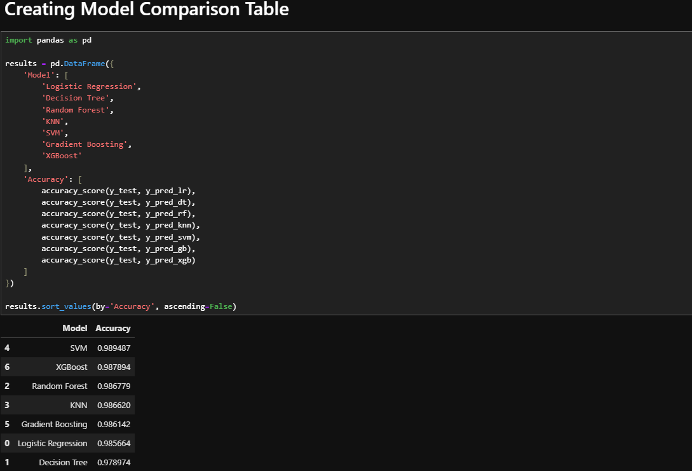
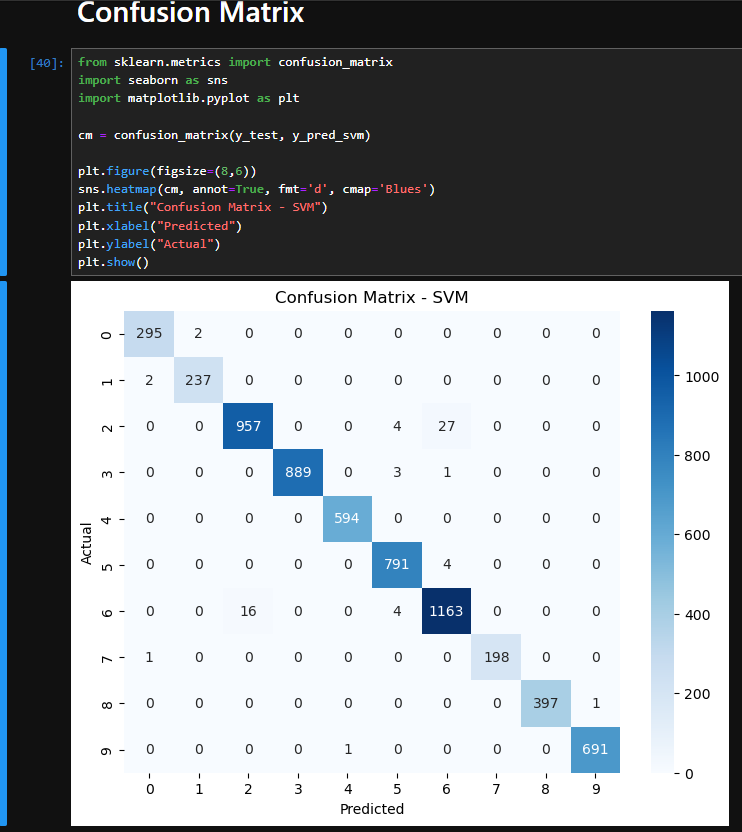

# 🍎 NutriClass: Food Classification Using Nutritional Data

## 📌 Project Overview

NutriClass is a Machine Learning classification project that predicts food categories using nutritional information. The project utilizes multiple machine learning algorithms to classify food items based on nutritional attributes such as calories, protein, fat, carbohydrates, sugar, fiber, sodium, cholesterol, glycemic index, water content, serving size, meal type, preparation method, vegan status, and gluten-free status.

The project follows a complete end-to-end Machine Learning workflow including data preprocessing, exploratory data analysis, feature engineering, dimensionality reduction, model training, evaluation, and comparison.

---

## 🎯 Project Objectives

- Analyze and understand nutritional food data.
- Handle missing values and duplicate records.
- Perform feature engineering and dimensionality reduction.
- Train and compare multiple classification algorithms.
- Evaluate model performance using standard metrics.
- Identify the best-performing model for food classification.

---

## 📂 Project Structure

```text
NutriClass_Food_Classification/
│
├── dataset/
│   └── synthetic_food_dataset_imbalanced.csv
│
├── notebooks/
│   └── NutriClass.ipynb
│
├── images/
│   ├── class_distribution.png
│   ├── confusion_matrix.png
│   ├── correlation_heatmap.png
│   ├── model_comparison.png
│   └── outlier_analysis.png
│
├── reports/
│   └── NutriClass_Project_Report.pdf
│
├── README.md
└── requirements.txt
```

---

## 🛠 Technologies Used

- Python
- Pandas
- NumPy
- Matplotlib
- Seaborn
- Scikit-Learn
- XGBoost
- Jupyter Notebook

---

## 📊 Dataset Information

The dataset contains nutritional information for multiple food categories.

### Features

- Calories
- Protein
- Fat
- Carbs
- Sugar
- Fiber
- Sodium
- Cholesterol
- Glycemic_Index
- Water_Content
- Serving_Size
- Meal_Type
- Preparation_Method
- Is_Vegan
- Is_Gluten_Free

### Target Variable

- Food_Name

---

## 🔍 Data Preprocessing

The following preprocessing techniques were applied:

- Missing Value Imputation
- Duplicate Record Removal
- Label Encoding
- Feature Scaling using StandardScaler
- Principal Component Analysis (PCA)

### PCA Result

- Original Features: 15
- Reduced Features: 9
- Variance Retained: 95%

---

## 📈 Exploratory Data Analysis

### Class Distribution

Shows the distribution of food categories.



---

### Outlier Analysis

Boxplots were used to identify potential outliers in numerical features.



---

### Correlation Heatmap

Visual representation of feature correlations.



---

## 🤖 Machine Learning Models

The following models were trained and evaluated:

1. Logistic Regression
2. Decision Tree
3. Random Forest
4. K-Nearest Neighbors (KNN)
5. Support Vector Machine (SVM)
6. Gradient Boosting
7. XGBoost

---

## 📊 Model Performance

| Model | Accuracy |
|---------|----------|
| Logistic Regression | 98.57% |
| Decision Tree | 97.90% |
| Random Forest | 98.68% |
| KNN | 98.66% |
| SVM | 98.95% |
| Gradient Boosting | 98.61% |
| XGBoost | 98.79% |

### Model Comparison



---

## 🏆 Best Model

### Support Vector Machine (SVM)

Performance:

- Accuracy: 98.95%
- Precision: 99%
- Recall: 99%
- F1-Score: 99%

Cross Validation Accuracy:

- Mean CV Accuracy: 99.30%

---

## 📉 Confusion Matrix

The confusion matrix demonstrates excellent classification performance with very few misclassifications.



---

## 💼 Business Use Cases

- Smart Dietary Applications
- Nutrition Recommendation Systems
- Food Tracking Platforms
- Health Monitoring Applications
- Educational Nutrition Tools
- Meal Planning Systems

---

## ✅ Expected Outcomes

- Accurate food classification using nutritional attributes.
- Comparison of multiple machine learning algorithms.
- Identification of the best-performing model.
- Insights into food nutritional patterns.

---

## 📌 Conclusion

The NutriClass project successfully classified food items using nutritional information and multiple machine learning algorithms. Among all evaluated models, Support Vector Machine (SVM) achieved the highest performance with an accuracy of approximately 98.95%.

The project demonstrates how machine learning can effectively support food classification, nutritional analytics, and intelligent dietary recommendation systems.

---

## 👩‍💻 Author

**Tania Banerjee**

GUVI - HCL Machine Learning Project
